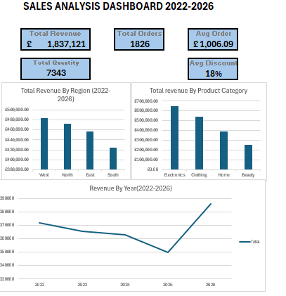

# Sales Analysis Dashboard (2022–2026)

## Overview
A complete Excel-based sales analysis project, covering data cleaning, transformation,
and dashboard design using Power Query, PivotTables, and PivotCharts.

## Business Problem
[ This project analyses regional and category-level sales
performance to identify top/bottom performers and support data-driven decisions.]

## Dataset
- Source: Kaggle.com
- 5,000 orders originally, filtered to 1,826 orders (2022–2026 scope)
- 17 columns including region, product category, revenue, discount, payment method

## Tools Used
- Microsoft Excel (Tables, PivotTables, PivotCharts)
- Power Query (data cleaning, filtering, merging)
- GitHub (version control, documentation)

## Data Preparation
[ raw vs. working file separation, duplicate sheet issue found/removed,
Link to: power-query/documentation.md]

## Power Query Transformations
[Brief summary — link to power-query/documentation.md for full detail]

## Analysis
[Brief summary of your 3 Pivots — link to documentation/analysis-notes.md]

## Dashboard
[Brief description — link to screenshots/dashboard-overview.png]

## Key Insights
[Summarize your top 2-3 insights briefly — link to documentation/business-insights.md for full detail]

## Project Structure

sales-analysis-dashboard/
├── data/raw/ → original untouched dataset
├── excel/ → working Excel file with Tables, Power Query, Pivots, Dashboard
├── power-query/ → Power Query transformation documentation
├── screenshots/ → dashboard screenshot
└── documentation/ → data dictionary, analysis notes, business insights

## Skills Demonstrated
- Excel Tables & structured references
- Power Query: cleaning, filtering, merging queries
- PivotTables & PivotCharts
- KPI calculation
- Dashboard design
- Business insight writing
- Git & GitHub version contro
